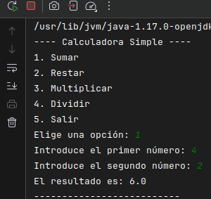

# Examen recuperación MVC

## Creación de las clases:
***Model*** , ***Controller***, ***View***

### MODEL

En el ***model*** se guardan los datos del programa.
En este caso se guardan las distintas operaciones: +, -. *, /.

    switch (operacion) {
    case "sumar":
    this.resultado = num1 + num2;
    break;
    case "restar":
    this.resultado = num1 - num2;
    break;
    case "multiplicar":
    this.resultado = num1 * num2;
    break;
    case "dividir":
    if (num2 == 0) {
    throw new ArithmeticException("No se puede dividir entre cero");
    }
    this.resultado = num1 / num2;
    break;

### VIEW

La ***view*** es la clase encargada de comonicarse con el usuario y recibir su información.

En este caso lo hace a traves de un menu que es el siguiente:

    public static void menu() {
    System.out.println("\n---- Calculadora Simple ----");
    System.out.println("1. Sumar");
    System.out.println("2. Restar");
    System.out.println("3. Multiplicar");
    System.out.println("4. Dividir");
    System.out.println("5. Salir");
    System.out.print("Elige una opción: ");
    }

Con un escaner se recoge la información del usuario para que el controller pueda usarla con la siguiente función: ```leerNumero```

### CONTROLLER

El ***controller*** es el intermediario entre la view y el model.
En este caso lo que hace es recibir la opcion elegida por el usuario que le llega desde la view y puede hacer los calculos con los datos almacenados en el model.


    double num1 = view.leerNumero("Introduce el primer número: ");
    double num2 = view.leerNumero("Introduce el segundo número: ");

            model.calcular(num1, num2, operacion);

Dependiando de la opción que escoja el usuario se ejecutará una operacion que esta guardada en el model:

    switch (opcion) {
    case 1 -> ejecutarOperacion("sumar");
    case 2 -> ejecutarOperacion("restar");
    case 3 -> ejecutarOperacion("multiplicar");
    case 4 -> ejecutarOperacion("dividir");
    case 5 -> {
    view.mostrarMensaje("¡Saliendo!");
    continuar = false;
    }
    default -> view.mostrarError("Opción no válida");

## Ejecución del programa:

* Aquí podemos ver como se ejecuta el menú y como funciona en este caso la opción 1 que sería "sumar"



* En esta imagen podemos ver como si hacemos una division normal nos da el resultado, pero si dividimos entre 0 salta una excepción.


# Examen recuperación MVC
---
Transforma esta aplicación según la arquitectura MVC vista en clase, sin cambiar la funcionalidad

Valoración:

* Clases por separado
* Funcionalidad de la vista (20 puntos)
* Funcionalidad del Controller (20 puntos)
* Utilización de Clase para guardar datos (como la clase Coche utilizada en clase) (20 puntos)
  * Coherencia con la clase Model (10 puntos)
* Realización de commits por cada paso que se realice (10 puntos)
* Comentarios en el código (5 puntos)
* Readme justificando la toma de desición y describiendo los beneficios aportados por el cambio de código (15 puntos)